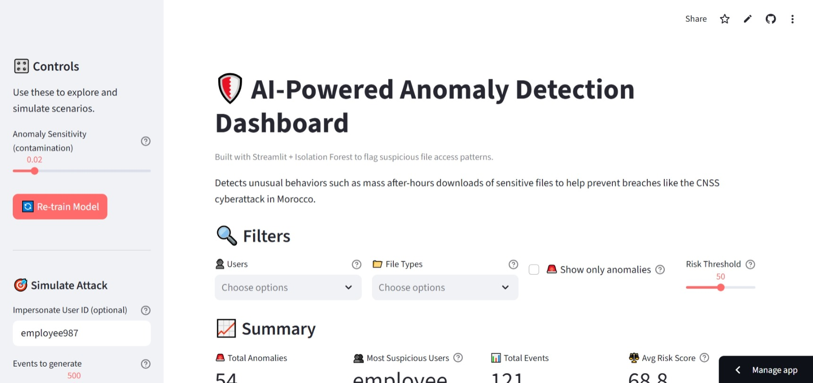

## AI-Powered Intrusion Detection Dashboard

Behavior-based intrusion detection for post-compromise scenarios. This Streamlit app analyzes user and file-access activity to flag suspicious behavior (e.g., mass downloads at odd hours, abnormal access patterns). Inspired by the CNSS April 2025 incident, it acts as an early-warning layer to reduce attacker dwell time and prevent data loss.

— Built with Python, Streamlit, scikit-learn, and Plotly.

## ✨ Key Features

- Behavioral anomaly detection with Isolation Forest
- Risk scoring (0–100) and high-risk alerts
- Interactive visuals: downloads by hour, size distribution, risk histogram, heatmaps, timeline
- Advanced filters by user, file type, and risk threshold
- One-click data export and attack simulation for demos

### ML Highlights
- Unsupervised detection (Isolation Forest)
- Time- and behavior-based feature engineering
- Model persistence (load/save) and retraining controls

## 🚀 Quick Start

1) Install
```bash
pip install -r requirements.txt
```

2) Run
```bash
streamlit run main.py
```

3) Optional: Tests
```bash
python test_app.py
```

## 🔗 Links

- GitHub repository: `https://github.com/ARWA044/AI-security-guard`
- Live demo (Streamlit Cloud): `https://ai-security-guard.streamlit.app/` (replace with your deployed URL)

## ℹ️ Project Status

This project is under active development. It currently uses simulated/random data and does not yet support uploading or testing with your own datasets. Custom data ingestion is planned for a future release.

## 🖼️ Screenshot / Demo



## ⚙️ Configuration (Summary)

Edit `config.py` to adjust:
- Contamination rate, estimators, sampling
- Working hours and file types
- Paths for data, logs, and models

<details>
<summary>How it works (technical)</summary>

1. Load or simulate access logs and validate data
2. Engineer behavioral features (e.g., hour-of-day, activity frequency, file sizes)
3. Score with Isolation Forest → normalize to risk score (0–100)
4. Surface high-risk events with alerts and visuals for triage

</details>

## 🔒 Note

This is a complementary detection layer focused on behavior inside the perimeter. It does not replace patching, identity controls, EDR, or SIEM/SOAR.


